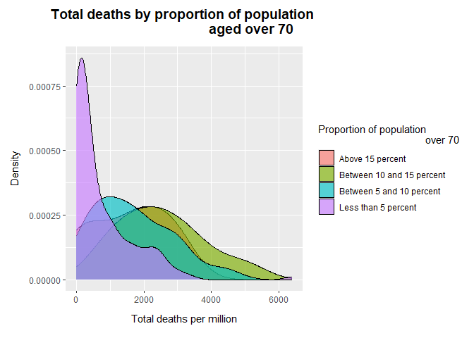
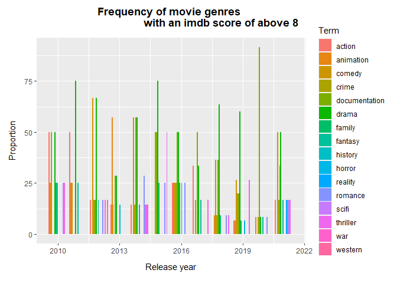

# Purpose

    # code used to set up folders
    #fmxdat::make_project()
    #Texevier::create_template_html(dir="C:\\Users\\tessa\\OneDrive\\Desktop\\Masters 2023\\Data science\\Exam\\21559953", template_name = "Question_1") 
    #Texevier::create_template(dir="C:\\Users\\tessa\\OneDrive\\Desktop\\Masters 2023\\Data science\\Exam\\21559953", template_name = "Question_2")
    #Texevier::create_template_html(dir="C:\\Users\\tessa\\OneDrive\\Desktop\\Masters 2023\\Data science\\Exam\\21559953", template_name = "Question3")
    #Texevier::create_template(dir="C:\\Users\\tessa\\OneDrive\\Desktop\\Masters 2023\\Data science\\Exam\\21559953", template_name = "Question_4")
    #Texevier::create_template(dir="C:\\Users\\tessa\\OneDrive\\Desktop\\Masters 2023\\Data science\\Exam\\21559953", template_name = "Question_5")

# Question 1

    # loading the data
    suppressMessages(library(tidyverse))

    ## Warning: package 'ggplot2' was built under R version 4.2.3

    ## Warning: package 'tibble' was built under R version 4.2.3

    ## Warning: package 'dplyr' was built under R version 4.2.3

    ## Warning: package 'forcats' was built under R version 4.2.3

    Loc <- "C:\\Users\\tessa\\OneDrive\\Desktop\\Masters 2023\\Data science\\Exam\\21559953\\Question_1\\data\\"
    deaths_df <- read_csv(glue::glue("{Loc}Deaths_by_cause.csv"))

    ## Rows: 7273 Columns: 36
    ## ── Column specification ────────────────────────────────────────────────────────
    ## Delimiter: ","
    ## chr  (3): Entity, Code, Number of executions (Amnesty International)
    ## dbl (33): Year, Deaths - Meningitis - Sex: Both - Age: All Ages (Number), De...
    ## 
    ## ℹ Use `spec()` to retrieve the full column specification for this data.
    ## ℹ Specify the column types or set `show_col_types = FALSE` to quiet this message.

    covid_df <- read_csv(glue::glue("{Loc}covid_data_description.csv"))

    ## Rows: 67 Columns: 4
    ## ── Column specification ────────────────────────────────────────────────────────
    ## Delimiter: ","
    ## chr (4): column, source, category, description
    ## 
    ## ℹ Use `spec()` to retrieve the full column specification for this data.
    ## ℹ Specify the column types or set `show_col_types = FALSE` to quiet this message.

    owid_df <- read_csv(glue::glue("{Loc}owid-covid-data.csv"))

    ## Rows: 194260 Columns: 67
    ## ── Column specification ────────────────────────────────────────────────────────
    ## Delimiter: ","
    ## chr   (4): iso_code, continent, location, tests_units
    ## dbl  (62): total_cases, new_cases, new_cases_smoothed, total_deaths, new_dea...
    ## date  (1): date
    ## 
    ## ℹ Use `spec()` to retrieve the full column specification for this data.
    ## ℹ Specify the column types or set `show_col_types = FALSE` to quiet this message.

    source("C:\\Users\\tessa\\OneDrive\\Desktop\\Masters 2023\\Data science\\Exam\\21559953\\Question_1\\code\\plots.R")

    # Figure 1
    covid_timeline <- data_transformer(owid_df)

    ## `summarise()` has grouped output by 'continent'. You can override using the
    ## `.groups` argument.

    cases_continent <- plotter(covid_timeline, covid_timeline$new_cases_mil, 
                               "New cases per million across continents", 
                               "New cases (millions)")
    cases_continent

    # Figure 2
    covid_timeline2 <- data_transformer(owid_df)

    ## `summarise()` has grouped output by 'continent'. You can override using the
    ## `.groups` argument.

    deaths_continent <- plotter(covid_timeline2, covid_timeline2$new_deaths_mil, 
                                "Deaths per million across continents", "New deaths 
                                per million")
    deaths_continent

    # Figure 3
    covid_timeline3 <- data_transformer(owid_df)

    ## `summarise()` has grouped output by 'continent'. You can override using the
    ## `.groups` argument.

    excess_deaths_continent <- plotter(covid_timeline3, covid_timeline3$excess_mort, 
                                       "Average excess mortality across continents", 
                                       "Excess mortality (%)")
    excess_deaths_continent

    # Figure 4
    vulnerability_df <- vulnerability_transformations(owid_df)

    ## `summarise()` has grouped output by 'iso_code'. You can override using the
    ## `.groups` argument.

    aged_vulnerability <- density_plotter(vulnerability_df, 
                                          vulnerability_df$Aged_population, 
                                          "Total deaths by proportion of population 
                                          aged over 70", "Proportion of population 
                                          over 70" )
    aged_vulnerability

    ## Warning: Removed 22 rows containing non-finite values (`stat_density()`).

    # Figure 5
    vulnerability_df <- vulnerability_transformations(owid_df)

    ## `summarise()` has grouped output by 'iso_code'. You can override using the
    ## `.groups` argument.

    diabetes_vulnerability <- density_plotter(vulnerability_df, 
                                              vulnerability_df$diabetes, 
                                              "Total deaths by diabetes prevalence", 
                                              "Diabetes prevalence" )
    diabetes_vulnerability

    ## Warning: Removed 22 rows containing non-finite values (`stat_density()`).

    # Figure 6
    Europe_hosp <- hospital_resp("Europe", "Admissions and number of patients 
                                 in Europe")

    ## `summarise()` has grouped output by 'continent'. You can override using the
    ## `.groups` argument.

    ## Warning: Using `size` aesthetic for lines was deprecated in ggplot2 3.4.0.
    ## ℹ Please use `linewidth` instead.
    ## This warning is displayed once every 8 hours.
    ## Call `lifecycle::last_lifecycle_warnings()` to see where this warning was
    ## generated.

    Europe_hosp

    # Figure 7
    Africa_hosp <- hospital_resp("Africa", "Admissions and number of patients in 
                                 Africa")

    ## `summarise()` has grouped output by 'continent'. You can override using the
    ## `.groups` argument.

    Africa_hosp

    # Figure 8
    Asia_hosp <- hospital_resp("Asia", "Admissions and number of patients in Asia")

    ## `summarise()` has grouped output by 'continent'. You can override using the
    ## `.groups` argument.

    Asia_hosp

# Question 2

    #loading the data
    library(tidyverse)
    weather <- read_csv("C:\\Users\\tessa\\OneDrive\\Desktop\\Masters 2023\\Data science\\Exam\\21559953\\Question_2\\data\\UKMonthly_Detailed.csv")

    ## Rows: 1707 Columns: 34
    ## ── Column specification ────────────────────────────────────────────────────────
    ## Delimiter: ","
    ## chr (17): STATION, DATE, NAME, CDSD_ATTRIBUTES, CLDD_ATTRIBUTES, DT00_ATTRIB...
    ## dbl (17): LATITUDE, LONGITUDE, ELEVATION, CDSD, CLDD, DT00, DT32, DX32, DX70...
    ## 
    ## ℹ Use `spec()` to retrieve the full column specification for this data.
    ## ℹ Specify the column types or set `show_col_types = FALSE` to quiet this message.

    london <- read_csv("C:\\Users\\tessa\\OneDrive\\Desktop\\Masters 2023\\Data science\\Exam\\21559953\\Question_2\\data\\london_weather.csv")

    ## Rows: 15341 Columns: 10
    ## ── Column specification ────────────────────────────────────────────────────────
    ## Delimiter: ","
    ## dbl (10): date, cloud_cover, sunshine, global_radiation, max_temp, mean_temp...
    ## 
    ## ℹ Use `spec()` to retrieve the full column specification for this data.
    ## ℹ Specify the column types or set `show_col_types = FALSE` to quiet this message.

    source("C:\\Users\\tessa\\OneDrive\\Desktop\\Masters 2023\\Data science\\Exam\\21559953\\Question_2\\code\\plots.R")

    # Figure 1
    library(lubridate)

    ## Loading required package: timechange
    ## 
    ## Attaching package: 'lubridate'
    ## 
    ## The following objects are masked from 'package:base':
    ## 
    ##     date, intersect, setdiff, union

    library(zoo)

    ## 
    ## Attaching package: 'zoo'
    ## 
    ## The following objects are masked from 'package:base':
    ## 
    ##     as.Date, as.Date.numeric

        start_date <- as.yearmon("1881-01")
        N <- 1707
        date <- data.frame(year_month = seq(start_date, length = N, by = 1/12))
        weather <- cbind(weather, date)
        
    temp_df <- df_transformer(weather)
    temps <- density_plotter(temp_df)

    ## Warning: package 'ggridges' was built under R version 4.2.3

    temps

    ## Picking joint bandwidth of 2.94

    # Figure 2
    max_temp <- df_transformer(temps)
    avg_temp <- line_plotter(max_temp)
    avg_temp

    # Table 
    weather_table <- table_formatter(london)

    ## Warning: package 'xtable' was built under R version 4.2.3

    weather_table

    ## \begin{table}[ht]
    ## \centering
    ## \begin{tabular}{rlrrr}
    ##   \hline
    ##  & Decade & avg\_cloud & avg\_sunshine & avg\_precip \\ 
    ##   \hline
    ## 1 & 1980s & 5.43 & 4.15 & 1.66 \\ 
    ##   2 & 1990s & 5.54 & 4.60 & 1.54 \\ 
    ##   3 & 2000s & 5.27 & 4.43 & 1.78 \\ 
    ##   4 & 2010s & 4.86 & 4.24 & 1.69 \\ 
    ##    \hline
    ## \end{tabular}
    ## \end{table}

# Question 3

    # loading the data
    Coldplay <- read_csv("C:\\Users\\tessa\\OneDrive\\Desktop\\Masters 2023\\Data science\\Exam\\21559953\\Question3\\data\\Coldplay.csv")

    ## Rows: 232 Columns: 15
    ## ── Column specification ────────────────────────────────────────────────────────
    ## Delimiter: ","
    ## chr   (2): name, album_name
    ## dbl  (11): duration, popularity, acousticness, danceability, energy, instrum...
    ## lgl   (1): explicit
    ## date  (1): release_date
    ## 
    ## ℹ Use `spec()` to retrieve the full column specification for this data.
    ## ℹ Specify the column types or set `show_col_types = FALSE` to quiet this message.

    metallica <- read_csv("C:\\Users\\tessa\\OneDrive\\Desktop\\Masters 2023\\Data science\\Exam\\21559953\\Question3\\data\\metallica.csv")

    ## Rows: 1468 Columns: 14
    ## ── Column specification ────────────────────────────────────────────────────────
    ## Delimiter: ","
    ## chr   (2): name, album
    ## dbl  (11): duration_ms, popularity, danceability, energy, loudness, speechin...
    ## date  (1): release_date
    ## 
    ## ℹ Use `spec()` to retrieve the full column specification for this data.
    ## ℹ Specify the column types or set `show_col_types = FALSE` to quiet this message.

    spotify <- read_csv("C:\\Users\\tessa\\OneDrive\\Desktop\\Masters 2023\\Data science\\Exam\\21559953\\Question3\\data\\Broader_Spotify_Info.csv")

    ## Rows: 50683 Columns: 19
    ## ── Column specification ────────────────────────────────────────────────────────
    ## Delimiter: ","
    ## chr  (7): track_id, name, artist, spotify_preview_url, spotify_id, tags, genre
    ## dbl (12): year, duration_ms, danceability, energy, key, loudness, speechines...
    ## 
    ## ℹ Use `spec()` to retrieve the full column specification for this data.
    ## ℹ Specify the column types or set `show_col_types = FALSE` to quiet this message.

    source("C:\\Users\\tessa\\OneDrive\\Desktop\\Masters 2023\\Data science\\Exam\\21559953\\Question3\\code\\plots.R")

    # Figure 1
    Coldplay <- Coldplay %>% mutate(band="Coldplay")
    songs_coldplay <- df_transformation(Coldplay) 
    coldplay_albums <- album_plotter(songs_coldplay, "Coldplay albums by valence, energy and instrumentallness")

    ## Warning: package 'viridis' was built under R version 4.2.3

    ## Loading required package: viridisLite

    coldplay_albums

    # Figure 2
    metallica <- metallica  %>% rename(duration=duration_ms)%>% rename(album_name=album) %>% 
        mutate(band="metallica")
    songs_metallica <- df_transformation(metallica) %>% filter(grepl("Deluxe|72|Magnetic|Garage|Load|Lulu|Monster|Anger", album_name)) %>% 
        filter(!grepl("Deluxe / Remastered", album_name))
    metallica_albums <- album_plotter(songs_metallica, "Metallica albums by 
                                      valence, energy and instrumentalness")
    metallica_albums

    # Figure 3
    coldplay_metallica <- direct_comparison(bands_plot)
    coldplay_metallica  

    # Figure 4
    genre_plot <- genre_comparison(genre_bar)
    genre_plot

    # Figure 5
    metallica_plot <- songs_metallica %>% 
        filter(!grepl("Garage,|Remastered Deluxe Box Set", album_name)) %>% 
        dplyr::select(name, album_name, popularity) %>% 
        group_by(album_name) %>% 
        summarise(mean = sum(popularity) / n(), se = sd(popularity) / sqrt(n()))

    metallica_bests <- popular_album_plotter(metallica_plot, "Average popularity by 
                                             Metallica album")
    metallica_bests

    # Figure 6
    coldplay_plot <- songs_coldplay %>% 
        dplyr::select(name, album_name, popularity) %>% 
        group_by(album_name) %>% 
        summarise(mean = sum(popularity, na.rm=TRUE) / n(), 
                  se = sd(popularity, na.rm=TRUE) / sqrt(n()))

    coldplay_bests <- popular_album_plotter(coldplay_plot, "Average popularity 
                                            by Coldplay album")
    coldplay_bests

# Question 4

    # loading the data
    library(tidyverse)
    credits <- read_csv("C:\\Users\\tessa\\OneDrive\\Desktop\\Masters 2023\\Data science\\Exam\\21559953\\Question_4\\data\\credits.csv")

    ## Rows: 77213 Columns: 5
    ## ── Column specification ────────────────────────────────────────────────────────
    ## Delimiter: ","
    ## chr (4): id, name, character, role
    ## dbl (1): person_id
    ## 
    ## ℹ Use `spec()` to retrieve the full column specification for this data.
    ## ℹ Specify the column types or set `show_col_types = FALSE` to quiet this message.

    titles <- read_csv("C:\\Users\\tessa\\OneDrive\\Desktop\\Masters 2023\\Data science\\Exam\\21559953\\Question_4\\data\\titles.csv")

    ## Rows: 5806 Columns: 15
    ## ── Column specification ────────────────────────────────────────────────────────
    ## Delimiter: ","
    ## chr (8): id, title, type, description, age_certification, genres, production...
    ## dbl (7): release_year, runtime, seasons, imdb_score, imdb_votes, tmdb_popula...
    ## 
    ## ℹ Use `spec()` to retrieve the full column specification for this data.
    ## ℹ Specify the column types or set `show_col_types = FALSE` to quiet this message.

    source("C:\\Users\\tessa\\OneDrive\\Desktop\\Masters 2023\\Data science\\Exam\\21559953\\Question_4\\code\\plots.R")

    # figure 1
    series_genres <- transformer_df("SHOW")
    series_genre_plot <- genre_plotter(series_genres, 
                                       "Frequency of series genres with an imdb 
                                       score of above 8")
    series_genre_plot

    # figure 2
    movie_genres <- transformer_df("MOVIE")
    movie_genre_plot <- genre_plotter(movie_genres, "Frequency of movie genres 
                                      with an imdb score of above 8")
    movie_genre_plot

    # Table
    top_actors_table <- popular_actors(popular_actors)
    top_actors_table

    ## \begin{table}[ht]
    ## \centering
    ## \begin{tabular}{rlrllr}
    ##   \hline
    ##  & Name & Average imdb score & Highest rated movie/series & Type & Release year \\ 
    ##   \hline
    ## 1 & Anna Gunn & 9.50 & Breaking Bad & SHOW & 2008.00 \\ 
    ##   2 & Betsy Brandt & 9.50 & Breaking Bad & SHOW & 2008.00 \\ 
    ##   3 & Cricket Leigh & 9.30 & Avatar: The Last Airbender & SHOW & 2005.00 \\ 
    ##   4 & Jessie Flower & 9.30 & Avatar: The Last Airbender & SHOW & 2005.00 \\ 
    ##   5 & Zach Tyler & 9.30 & Avatar: The Last Airbender & SHOW & 2005.00 \\ 
    ##   6 & He Kailang & 9.20 & Who Rules The World & SHOW & 2022.00 \\ 
    ##   7 & Kim Seol & 9.20 & Reply 1988 & SHOW & 2015.00 \\ 
    ##   8 & Lee Hye-ri & 9.20 & Reply 1988 & SHOW & 2015.00 \\ 
    ##   9 & Lee Ji-ah & 9.20 & My Mister & SHOW & 2018.00 \\ 
    ##   10 & Ryu Jun-yeol & 9.20 & Reply 1988 & SHOW & 2015.00 \\ 
    ##   11 & Son Sook & 9.20 & My Mister & SHOW & 2018.00 \\ 
    ##   12 & Zhang Feng Yi & 9.20 & Who Rules The World & SHOW & 2022.00 \\ 
    ##   13 & Jason Hehir & 9.10 & The Last Dance & SHOW & 2020.00 \\ 
    ##   14 & Michael Jordan & 9.10 & The Last Dance & SHOW & 2020.00 \\ 
    ##   15 & Phil Jackson & 9.10 & The Last Dance & SHOW & 2020.00 \\ 
    ##   16 & Scottie Pippen & 9.10 & The Last Dance & SHOW & 2020.00 \\ 
    ##   17 & Steve Kerr & 9.10 & The Last Dance & SHOW & 2020.00 \\ 
    ##   18 & Alastair Fothergill & 9.00 & David Attenborough: A Life on Our Planet & MOVIE & 2020.00 \\ 
    ##   19 & Ariel Staltari & 9.00 & Okupas & SHOW & 2000.00 \\ 
    ##   20 & Augusto Brítez & 9.00 & Okupas & SHOW & 2000.00 \\ 
    ##    \hline
    ## \end{tabular}
    ## \end{table}

# Question 5

    # loading the data
    playstore <- read_csv("C:\\Users\\tessa\\OneDrive\\Desktop\\Masters 2023\\Data science\\Exam\\21559953\\Question_5\\data\\googleplaystore.csv")

    ## Rows: 10054 Columns: 13
    ## ── Column specification ────────────────────────────────────────────────────────
    ## Delimiter: ","
    ## chr (11): App, Category, Size, Installs, Type, Price, Content Rating, Genres...
    ## dbl  (2): Rating, Reviews
    ## 
    ## ℹ Use `spec()` to retrieve the full column specification for this data.
    ## ℹ Specify the column types or set `show_col_types = FALSE` to quiet this message.

    reviews <- read_csv("C:\\Users\\tessa\\OneDrive\\Desktop\\Masters 2023\\Data science\\Exam\\21559953\\Question_5\\data\\googleplaystore_user_reviews.csv")

    ## Rows: 64295 Columns: 5
    ## ── Column specification ────────────────────────────────────────────────────────
    ## Delimiter: ","
    ## chr (3): App, Translated_Review, Sentiment
    ## dbl (2): Sentiment_Polarity, Sentiment_Subjectivity
    ## 
    ## ℹ Use `spec()` to retrieve the full column specification for this data.
    ## ℹ Specify the column types or set `show_col_types = FALSE` to quiet this message.

    source("C:\\Users\\tessa\\OneDrive\\Desktop\\Masters 2023\\Data science\\Exam\\21559953\\Question_5\\code\\plots.R")

    # Figure 1 
    ratings_category <- ratings_plot(playstore)
    ratings_category

    # Figure 2
    hundred_mil_plus <- pie_plotter("100,000,000+")

    ## `summarise()` has grouped output by 'Installs'. You can override using the
    ## `.groups` argument.

    hundred_mil_plus

    # Figure 3
    category_reviews <- reviews_plot(review_sentiment)

    ## Warning in left_join(reviews, app_df, "App"): Detected an unexpected many-to-many relationship between `x` and `y`.
    ## ℹ Row 1 of `x` matches multiple rows in `y`.
    ## ℹ Row 1178 of `y` matches multiple rows in `x`.
    ## ℹ If a many-to-many relationship is expected, set `relationship =
    ##   "many-to-many"` to silence this warning.

    ## Warning in left_join(playstore, reviews, "App"): Detected an unexpected many-to-many relationship between `x` and `y`.
    ## ℹ Row 8 of `x` matches multiple rows in `y`.
    ## ℹ Row 17208 of `y` matches multiple rows in `x`.
    ## ℹ If a many-to-many relationship is expected, set `relationship =
    ##   "many-to-many"` to silence this warning.

    ## `summarise()` has grouped output by 'Category'. You can override using the
    ## `.groups` argument.

    category_reviews

    # Figure 4
    subjective_sentiment_cat <- Subjective_sent(sentiment_table)

    ## Warning in left_join(reviews, app_df, "App"): Detected an unexpected many-to-many relationship between `x` and `y`.
    ## Detected an unexpected many-to-many relationship between `x` and `y`.
    ## ℹ Row 1 of `x` matches multiple rows in `y`.
    ## ℹ Row 1178 of `y` matches multiple rows in `x`.
    ## ℹ If a many-to-many relationship is expected, set `relationship =
    ##   "many-to-many"` to silence this warning.

    ## `summarise()` has grouped output by 'Category'. You can override using the
    ## `.groups` argument.

    ## Warning in left_join(playstore, reviews, "App"): Detected an unexpected many-to-many relationship between `x` and `y`.
    ## ℹ Row 8 of `x` matches multiple rows in `y`.
    ## ℹ Row 17208 of `y` matches multiple rows in `x`.
    ## ℹ If a many-to-many relationship is expected, set `relationship =
    ##   "many-to-many"` to silence this warning.

    subjective_sentiment_cat

    ## \begin{table}[ht]
    ## \centering
    ## \begin{tabular}{rlr}
    ##   \hline
    ##  & App category & Average sentiment subjectivity \\ 
    ##   \hline
    ## 1 & LIFESTYLE & 0.45 \\ 
    ##   2 & BUSINESS & 0.45 \\ 
    ##   3 & SOCIAL & 0.46 \\ 
    ##   4 & MAPS\_AND\_NAVIGATION & 0.46 \\ 
    ##   5 & TOOLS & 0.46 \\ 
    ##   6 & ENTERTAINMENT & 0.47 \\ 
    ##   7 & PRODUCTIVITY & 0.47 \\ 
    ##   8 & NEWS\_AND\_MAGAZINES & 0.48 \\ 
    ##   9 & FINANCE & 0.48 \\ 
    ##   10 & VIDEO\_PLAYERS & 0.48 \\ 
    ##    \hline
    ## \end{tabular}
    ## \end{table}
